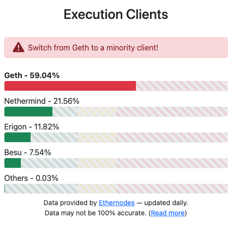
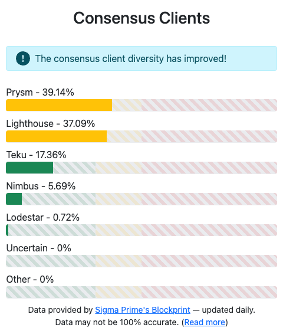

# How to stake Ethereum completely on your own (Ubuntu / Erigon / Lighthouse / Grafana / Prometheus / Goerli)

## Video tutorial

A video version of this tutorial is available on YouTube: https://youtu.be/23mx4wvE2_4

[](https://youtu.be/23mx4wvE2_4)

## Hardware

- Intel NUC (Intel NUC 10 Performance BXNUC10I5FNKN2)
- Intel Core i5 10210U
- Intel
- 16GB RAM DDR4
- 2TB SSD (Crucial P3 CT2000P3SSD8 M.2 2280 2TB PCIe NVMe)

## Operating System

Ubuntu 22.04.2 LTS

Download from https://ubuntu.com/download/desktop

Create a bootable USB stick with balena Etcher: https://www.balena.io/etcher/

Boot from the USB stick and install Ubuntu.

To bring up the boot menu, you usually need to press F12 or F10. For my NUC, it was F10.

I used the default settings for installation. It takes about 5-10 minutes to install.

## Preparing the OS

First, create a new user. Don't do everything with your default account, or even worse, with root account.

Adding a new user `ethereum` and setting a password

```shell
sudo useradd -m -s /bin/bash ethereum
sudo passwd ethereum
```

Grant the new user admin rights by adding it to a superuser group.
This will allow this user to perform all the actions / installations / upgrades etc.

```shell
sudo usermod -aG sudo ethereum
```

Update and upgrade the system.
If it was a fresh install, this step can take 10-15 minutes.

```shell
sudo apt-get update -y && sudo apt dist-upgrade -y
```

Clean up after the installation.

```shell
sudo apt-get autoremove
sudo apt-get autoclean
```

## Launchpad

Now that we have a fresh and clean operating system, let's start the process to become a validator.

The process below is for Goerli, so I'll use Goerli Launchpad on ethereum.org but for mainnet the process is practically identical, with a couple command options for network being different during the setup process.

To start, go to
https://goerli.launchpad.ethereum.org/en/
and go through the list.

Read and understand what each item means. They are all important.

Crucially, you need to have **32 ETH** to start staking. Testnet or mainnet, you need 32 ETH.

You also need a stable, reliable, fast internet connection. Your validator's performance and your staking rewards will rely on that.

## The execution client (Erigon)

After going through the checklist, it's time to decide on the execution client (what you will need to run your Ethereum node).

You'll also need a consensus client but we'll do that in the next step.

There are multiple execution clients and multiple consensus clients. Which ones to choose?

Usually going with the most popular option is a good choice, but not in this case.

https://clientdiversity.org/



Diversity is not just important for a more resilient network, it's essential, even crtical.

It takes 2/3rds of validators to reach finality. If a client with 66%+ of marketshare has a bug and forks to its own chain, it'll be capable of finalizing. Once the fork finalizes, the **validators cannot return to the real chain without being slashed**. If 66% of the chain gets slashed simultaneously, the penalty is the whole 32 ETH.

With no client having a marketshare over 33%, these scenarios are avoided. That's why **<33% marketshare is the goal for all clients**.

**Execution clients are not immune.** The risks mentioned above apply to both consensus clients and execution clients equally.

So to run an Ethereum node, I'll use Erigon. For consensus, it's going to be Lighthouse.

Let's contribute to decentralization, safety and protocol robustness.

For Erigon, their Github has all the installation instructions.

https://github.com/ledgerwatch/erigon

Download the latest version, compile, and build Erigon

```sh
git clone --branch stable --single-branch https://github.com/ledgerwatch/erigon.git
```

Next, I'll need to have go programming language installed on my system.

Download "go", then extract it.

```sh
sudo tar -C /usr/local -xzf go1.20.1.linux-amd64.tar.gz
```

Then add it to $PATH

```sh
export PATH=$PATH:/usr/local/go/bin
```

Verify if it works.

```sh
go version
```

It does. But it doesn't work in a new terminal window, so we need to add it to `.profile` to work system-wide.

Then source the `.profile` file and now everything works fine. go is installed.

Now it's time to compile, and build Erigon

```sh
cd erigon
make erigon
./build/bin/erigon
```

Create the data directory for Erigon.
This is where the blockchain data will be stored.
Update user owner for the directory.

```sh
sudo mkdir -p /var/lib/erigon
sudo chown $USER:$USER /var/lib/erigon
```

Communication between execution and consensus clients is secured using a JSON Web Token (JWT).
It's a file that contains a randomly generated 32-byte hex string.
Let's generate it.

```sh
# Store the jwtsecret file at /secrets
sudo mkdir -p /secrets

# Create the jwtsecret file
openssl rand -hex 32 | tr -d "\n" | sudo tee /secrets/jwtsecret

# Enable read access
sudo chmod 644 /secrets/jwtsecret
```

Now it's time to create a systemd service config file to configure the Erigon service.

A service is **a program that runs in the background outside the interactive control of system users as they lack an interface**.
This in order to provide even more security, and also for easily bringing the service up after failure, system reboot, or power outage.
Service is configured to relaunch automatically, with all the required options, with no action needed on the user's part.
All the important parts of the validator will be configured using services, so you'll see a lot more of this process:

- Configure everything in a service config file
- Reload services
- Enable the service
- Start the service
- View status and logs to see if everything works fine

```sh
sudo nano eth1.service
```

```apacheconf
[Unit]
Description=Erigon Execution Layer Client service (Goerli Test Network)
Wants=network-online.target
After=network-online.target

[Service]
Type=simple
User=$USER
Restart=always
RestartSec=5
KillSignal=SIGINT
TimeoutStopSec=300
ExecStart=/home/ethereum/erigon/build/bin/erigon \
 --datadir /var/lib/erigon \
 --chain goerli \
 --metrics \
 --pprof \
 --prune htc \
 --authrpc.jwtsecret=/secrets/jwtsecret \
 --externalcl \
 --http.addr="0.0.0.0" \
 --http.port=8545 \
 --http.api=engine,net,eth

[Install]
WantedBy=multi-user.target
```

`ExecStart=/home/ethereum/erigon/build/bin/erigon` The command that the service is configured for

`--chain goerli` For Goerli test network

`--authrpc.jwtsecret=/secrets/jwtsecret` The path to JWT secret file generated earlier

`--externalcl` Required flag to indicate the use of an external consensus client for validator duties.

`--metrics` Enables the metrics output for Prometheus monitoring

```sh
sudo mv $HOME/eth1.service /etc/systemd/system/eth1.service
sudo chmod 644 /etc/systemd/system/eth1.service
```

Reload daemon and enable the service

```sh
sudo systemctl daemon-reload
sudo systemctl enable eth1
```

Start Erigon service

```sh
sudo systemctl start eth1
```

View service logs to make sure everything is working properly.

```sh
journalctl -fu eth1
```

Helpful commands for services:

```sh
sudo systemctl stop eth1
sudo systemctl start eth1
sudo systemctl status eth1
```

Disk space used at this time: around 200GB.

## Create validator keys (Wagyu)

The number of validator keys: 1

Operating system: Linux

Download Key Gen GUI app

Download key generator at https://wagyu.gg/

Choose the binary for your OS.

`AppImages` requires `FUSE` to run.

Install FUSE

```shell
sudo apt-get install fuse libfuse2
```

Run the Wagyu Key Gen file again. It should open fine now.

Select the appropriate network (Goerli) in the top-right corner.

In the next step, it will create a secret recovery phrase.

Write it down. You won't be able to retrieve your funds without it.

Retype the secret recovery phrase in the next step, to make sure you got it right.

Create a password and add your withdrawal address. Your wallet where you want to get funds.

Retype the password and choose a folder where you'll store your keys.

I selected `/home/ethereum/keys`

It will be needed later on, when configuring the consensus client.

Two files will be created: keystore file and deposit data file.

## The consensus client (Lighthouse)

For consensus client, we'll run Lighthouse. For the same reason as choosing Erigon for execution: decentralization, safety, and protocol health.



Lighthouse Book has all the necessary installation and configuration info.

https://lighthouse-book.sigmaprime.io/

Extract the archive and copy lighthouse to /usr/local/bin

```shell
tar -xvf https://github.com/sigp/lighthouse/releases/download/v3.5.1/lighthouse-v3.5.1-x86_64-unknown-linux-gnu-portable.tar.gz
sudo cp lighthouse /usr/local/bin
```

Create a directory to store the validator data.

```sh
sudo mkdir -p /var/lib/lighthouse
```

Run the validator import process.
Make sure to provide the correct path to the generated keys directory.

```sh
sudo /usr/local/bin/lighthouse --network goerli account validator import --directory $HOME/keys --datadir /var/lib/lighthouse
```

Enter the password for the keys, so that you don't need to enter it each time the validator client restarts (when you might not be around).

This will import the validator.

Add a new user for the beacon node

```sh
sudo useradd --no-create-home --shell /bin/false lighthousebeacon
```

Create a directory and change owner to the new user

```sh
sudo mkdir -p /var/lib/lighthouse/beacon
sudo chown -R lighthousebeacon:lighthousebeacon /var/lib/lighthouse/beacon
```

Create a service config file for beacon node

```sh
sudo nano /etc/systemd/system/lighthousebeacon.service
```

```apacheconf
[Unit]
Description=Lighthouse Consensus Client BN (Goerli Test Network)
Wants=network-online.target
After=network-online.target[Service]

[Service]
User=lighthousebeacon
Group=lighthousebeacon
Type=simple
Restart=always
RestartSec=5
ExecStart=/usr/local/bin/lighthouse bn \
  --network goerli \
  --datadir /var/lib/lighthouse \
  --http \
  --execution-endpoint http://localhost:8551 \
  --execution-jwt /secrets/jwtsecret \
  --checkpoint-sync-url https://prater.checkpoint.sigp.io \
  --metrics

[Install]
WantedBy=multi-user.target
```

Command options to look out for:

- `--network goerli` for the correct network
- `--datadir` for the correct directory
- `--metrics` to be able to run metrics and dashboards later
- `--execution-jwt` for the correct secret
- `--checkpoint-sync-url` choose from the list of Ethereum Beacon Chain checkpoint sync endpoints at https://eth-clients.github.io/checkpoint-sync-endpoints/ with multiple options for each network (mainnet, goerli, sepolia)

Start the service

```sh
sudo systemctl daemon-reload
sudo systemctl start lighthousebeacon
sudo systemctl status lighthousebeacon
```

Check the logs

```sh
sudo journalctl -fu lighthousebeacon
```

Enable the service

```sh
sudo systemctl enable lighthousebeacon
```

Add user for the validator

```sh
sudo useradd --no-create-home --shell /bin/false lighthousevalidator
```

Change owner for the folder

```sh
sudo chown -R lighthousevalidator:lighthousevalidator /var/lib/lighthouse/validators
```

Service config file for a validator

```sh
sudo nano /etc/systemd/system/lighthousevalidator.service
```

```apacheconf
[Unit]
Description=Lighthouse Consensus Client VC (Goerli Test Network)
Wants=network-online.target
After=network-online.target

[Service]
User=lighthousevalidator
Group=lighthousevalidator
Type=simple
Restart=always
RestartSec=5
ExecStart=/usr/local/bin/lighthouse vc \
  --network goerli \
  --datadir /var/lib/lighthouse \
  --suggested-fee-recipient 0x498098ca1b7447fC5035f95B80be97eE16F82597 \
  --graffiti "Validatooor"

[Install]
WantedBy=multi-user.target
```

`--suggested-fee-recipient` your wallet address where you want to collect the fees
`--graffiti "Validatooor"` a touch of your own personality. Add whatever you want to be kept on blockchain as a graffiti. Try not to share info that easily identifies you :)

Start the service, check status

```sh
sudo systemctl daemon-reload
sudo systemctl start lighthousevalidator
sudo systemctl status lighthousevalidator
```

Check the logs

```sh
sudo journalctl -fu lighthousevalidator
```

Enable the validator

```sh
sudo systemctl enable lighthousevalidator
```

### Funding the validator

With execution and consensus clients live, it's time to add your keys.

The keys are in the `$HOME/keys/` directory and should look like something this:

- `deposit_data-234324324.json`
- `keystore-m_423_324_0_0_0-234432.json`

In the Launchpad, at step "Upload deposit data", upload the first file.

Connect your wallet that you'll be funding the validator from. It should have at least 32 ETH in it.

In the next step, click "Confirm deposit" and confirm the transaction in your wallet.

This is when you'll be sending 32 ETH to fund your validator. Make sure that:

- You're connected to the correct network
- You're sending the transaction to the correct contract address
- The function name next to contract address is "DEPOSIT"

## Monitoring (Prometheus)

Download the lates Prometheus release from https://prometheus.io/download/

```sh
curl -LO https://github.com/prometheus/prometheus/releases/download/v2.42.0/prometheus-2.42.0.linux-amd64.tar.gz
```

Extract and copy to /usr/local/bin

```sh
tar xvf prometheus-2.42.0.linux-amd64.tar.gz
sudo cp prometheus-2.42.0.linux-amd64/prometheus /usr/local/bin/
sudo cp prometheus-2.42.0.linux-amd64/promtool /usr/local/bin/
```

```sh
sudo cp -r prometheus-2.42.0.linux-amd64/consoles /etc/prometheus
sudo cp -r prometheus-2.42.0.linux-amd64/console_libraries /etc/prometheus
```

Clean up

```sh
rm prometheus-2.42.0.linux-amd64.tar.gz
rm -r prometheus-2.42.0.linux-amd64
```

Add a new user

```sh
sudo useradd --no-create-home --shell /bin/false prometheus
```

Create a directory to store files

```sh
sudo mkdir -p /var/lib/prometheus
```

Prometheus config file

```sh
sudo nano /etc/prometheus/prometheus.yml
```

```yaml
global:
  scrape_interval: 15s
scrape_configs:
  - job_name: prometheus
    static_configs:
      - targets:
          - localhost:9010
  - job_name: node_exporter
    static_configs:
      - targets:
          - localhost:9100
  - job_name: lighthouse
    metrics_path: /metrics
    static_configs:
      - targets:
          - localhost:5054
  - job_name: erigon
    metrics_path: /debug/metrics/prometheus
    static_configs:
      - targets:
          - localhost:6060
```

Change file ownership

```sh
sudo chown -R prometheus:prometheus /etc/prometheus
sudo chown -R prometheus:prometheus /var/lib/prometheus
```

Service config file for Prometheus

```sh
sudo nano /etc/systemd/system/prometheus.service
```

```apacheconf
[Unit]
Description=Prometheus
Wants=network-online.target
After=network-online.target

[Service]
Type=simple
User=prometheus
Group=prometheus
Restart=always
RestartSec=5
ExecStart=/usr/local/bin/prometheus \
  --config.file=/etc/prometheus/prometheus.yml \
  --storage.tsdb.path=/var/lib/prometheus \
  --web.console.templates=/etc/prometheus/consoles \
  --web.console.libraries=/etc/prometheus/console_libraries \
  --web.listen-address=:9010

[Install]
WantedBy=multi-user.target
```

Start the service

```sh
sudo systemctl daemon-reload
sudo systemctl start prometheus
sudo systemctl status prometheus
```

Check the logs

```sh
sudo journalctl -fu prometheus
```

Enable Prometheus

```sh
sudo systemctl enable prometheus
```

## Monitoring (Node Exporter)

Download the latest version from https://prometheus.io/download/#node_exporter

```sh
curl -LO https://github.com/prometheus/node_exporter/releases/download/v1.5.0/node_exporter-1.5.0.linux-amd64.tar.gz
```

Extract, copy to /usr/local/bin

```sh
tar xvf node_exporter-1.5.0.linux-amd64.tar.gz
sudo cp node_exporter-1.5.0.linux-amd64/node_exporter /usr/local/bin
```

Clean up

```sh
rm node_exporter-1.5.0.linux-amd64.tar.gz
rm -r node_exporter-1.5.0.linux-amd64
```

Add new user

```sh
sudo useradd --no-create-home --shell /bin/false node_exporter
```

Service config file

```sh
sudo nano /etc/systemd/system/node_exporter.service
```

```apacheconf
[Unit]
Description=Node Exporter
Wants=network-online.target
After=network-online.target

[Service]
User=node_exporter
Group=node_exporter
Type=simple
Restart=always
RestartSec=5
ExecStart=/usr/local/bin/node_exporter

[Install]
WantedBy=multi-user.target
```

Start the service

```sh
sudo systemctl daemon-reload
sudo systemctl start node_exporter
sudo systemctl status node_exporter
```

Check logs

```sh
sudo journalctl -fu node_exporter
```

Enable the service

```sh
sudo systemctl enable node_exporter
```

## Dashboards (Grafana)

Add Grafana apt sources

```sh
wget -q -O - https://packages.grafana.com/gpg.key | sudo apt-key add -
sudo add-apt-repository "deb https://packages.grafana.com/oss/deb stable main"
```

Refresh

```sh
sudo apt update
```

Make sure it's installed from the repository

```sh
apt-cache policy grafana
```

Check the latest version at https://grafana.com/grafana/download

Install Grafana

```sh
sudo apt install -y grafana
```

Start Grafana server

```sh
sudo systemctl start grafana-server
sudo systemctl status grafana-server
```

Check logs

```sh
sudo journalctl -fu grafana-server
```

Enable it

```sh
sudo systemctl enable grafana-server
```

Go to http://localhost:3000 and you should see the login screen for Grafana.

Username and password are both `admin`. In the next step you'll create a new password for your Grafana server.

Config files for Grafana dashboards:

- Execution client dashboard (Erigon): https://raw.githubusercontent.com/ledgerwatch/erigon/devel/cmd/prometheus/dashboards/erigon.json
- Consensus client dashboard (Lighthouse): https://raw.githubusercontent.com/sigp/lighthouse-metrics/master/dashboards/Summary.json

### What else do you need to take into account when staking on your own?

Securing your computer. Firewall with open ports only for services you use.

Go through the checklist on Launchpad ( https://goerli.launchpad.ethereum.org/en/checklist ) and make sure you have everything covered.

### Congratulations!

You have now set up your own Ethereum validator from scratch.

Happy decentralizing, happy earning, and see you soon!

— Radek
